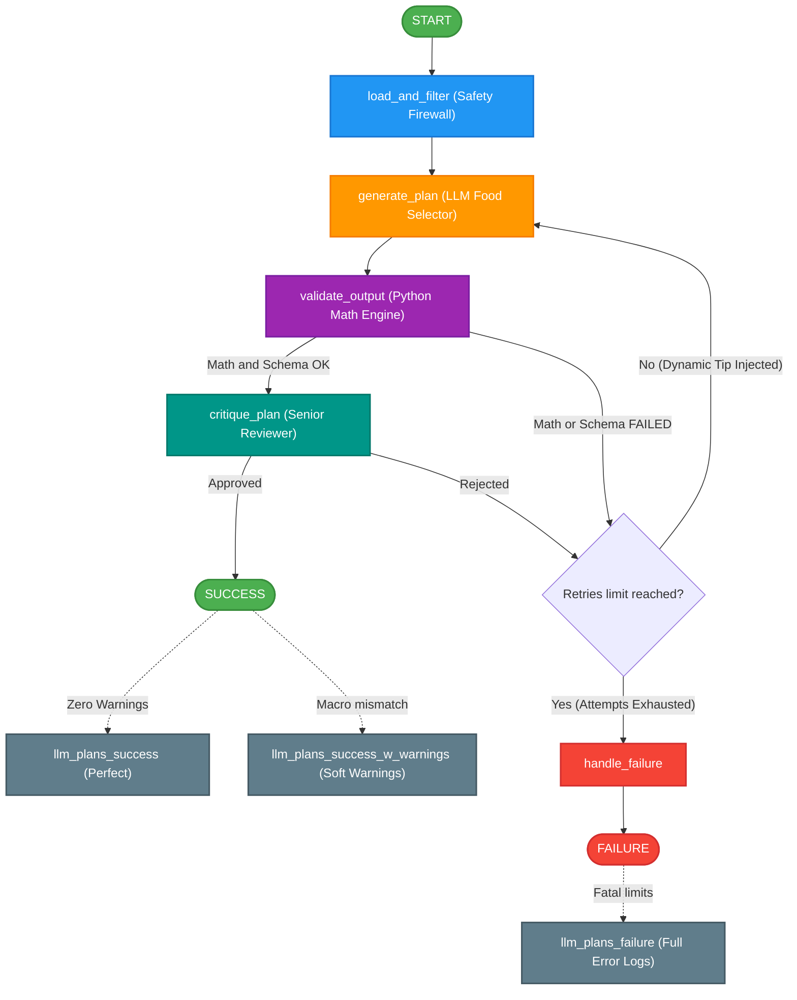

# Meal Plan Generator – AI Engineer Challenge (Nutrium)

An intelligent, LLM-powered workflow that generates personalised 1-day meal plans for patients. Built with **LangGraph**, **LangChain**, and **OpenAI GPT-4o**.

## Architecture



### Nodes

| Node | Purpose |
|------|---------|
| `load_and_filter` | Loads patient profile & food lists, applies safety filtering (allergies, intolerances, dislikes) |
| `generate_plan` | Calls GPT-4o with structured prompts to generate a 1-day meal plan in strict JSON |
| `validate_output` | Validates JSON schema, required meals, food IDs, nutritional math consistency |
| `critique_plan` | LLM-based critique checking patient adaptation, safety, and target adherence |
| `handle_failure` | Terminal node when max retries (3) are exhausted |

See [architecture.md](architecture.md) for the full Mermaid diagram.

---

## Setup

### 1. Prerequisites

- Python 3.10+
- An OpenAI API key

### 2. Install dependencies

```bash
pip install -r requirements.txt
```

### 3. Configure environment

Create a `.env` file in the project root (one is already provided) and set your API keys:

```bash
OPENAI_API_KEY=sk-proj-...

# Optional: LangSmith Observability
LANGCHAIN_TRACING_V2=true
LANGCHAIN_ENDPOINT="https://api.smith.langchain.com"
LANGCHAIN_PROJECT="Nutrium_Meal_Planner"
LANGCHAIN_API_KEY="YOUR_LANGSMITH_API_KEY"
```

---

## How to Run

### Run for all patients

```bash
python main.py
```

### Run for a specific patient

```bash
python main.py --patient "Paciente 1"
```

### Output Routing

The script prints the graph progression in real time and automatically routes the finalized meal plan into one of three designated folders based on output quality:

- 📁 `llm_plans_success/` : Architecturally perfect plans hitting all targets.
- 📁 `llm_plans_success_w_warnings/` : Valid plans that passed the critical Calorie target, but missed the strict macro baseline (Soft Warnings preserved in the JSON).
- 📁 `llm_plans_failure/` : Flawed generation attempts that fatally failed adherence testing even after 3 retry loops (Fatal errors preserved in the JSON).

---

## Prompt Strategy

My implementation uses a highly defensive, agent-based prompt strategy governed by **Separation of Concerns**: the LLM handles qualitative heuristic choices (food variety), while the Python backend enforces quantitative rules (exact math). 

### 1. The Defensive "Generation" Prompt
- **Schema Enforcement**: The exact JSON architecture is embedded in the prompt.
- **Pre-Flight Filtered Data**: The LLM *never* sees food items a patient dislikes or is allergic to. We physically filter the Context before the prompt is generated, dramatically reducing hallucination risks and token context weight.
- **Dose Tagging System**: Instead of having the LLM compute gram-level math, it selects basic units and tags them with a scaling factor matching the DB rules, e.g., `(Multiplier: 1.5)`. The Python backend then recalculates the *true* nutrition array deterministically from the database and naturally formats fractions (e.g., `0.75` to `1.0 unidades`) for visually pristine human readouts.

### 2. Dynamic Target Refinement (The "Ratio Tip")
Instead of statically failing a bad plan, the graph calculates the discrepancy between the Goal and the Output. If the output misses the calorie target, we execute a **Dynamic Prompt Injection** for the retry: 
* *Example: "You are significantly OVER the calorie target. You must SCALE DOWN your CURRENT food quantities by ~0.8x! If you used `(Multiplier: 2.0)`, change it to `1.5`..."*
This allows the iterative LLM to scale itself progressively in steps, instead of oscillating blindly between extremes.

### 3. The "Critique" Prompt
Before a mathematically valid plan is officially approved, a secondary "Senior Reviewer" prompt evaluates the output for logical human sense to ensure that the patient isn't receiving absurd suggestions (e.g., Ice cream for Breakfast) and that meal distributions correctly map onto their biological routine.

---

## Project Structure

```
├── UseCase/                     # Input data
│   ├── input_lists.jsonl        # 19 food alternative lists
│   ├── input_nutri_approval.jsonl  # 5 patient profiles
│   └── openai_api_key.txt
├── src/
│   ├── models.py                # Pydantic data models
│   ├── data_loader.py           # Input file parsers
│   ├── safety_filter.py         # Allergy/intolerance/dislike filters
│   ├── prompts.py               # LLM prompt templates
│   ├── nodes.py                 # LangGraph node functions
│   ├── graph.py                 # LangGraph workflow definition
│   └── validators.py            # Output validation checks
├── main.py                      # Entry point
├── architecture.md              # Architecture diagram
├── requirements.txt             # Python dependencies
├── .env                         # API key configuration
└── README.md                    # This file
```

---

## Evaluation Metrics

The architecture validates generated plans via structured guardrails, distinguishing between *Fatal Blocks* and *Soft Warnings*.

| Metric | Check |
|--------|-------|
| **JSON Schema** | Must strictly parse into the `MealPlan` Pydantic model (Failure loops back to Generator). |
| **Meal Structure** | Flexible to patient habits (2 to 6 meals). Follows chronological naming conventions. |
| **Food Selection** | Every ingredient string contains a regex-matched DB `(ID: XXXXX)` corresponding to a real database entry. |
| **Math Determinism** | Backend forcefully overwrites the LLM's calculations and derives ultimate macros by mapping `base_food_macros * Multiplier`. |
| **Caloric Guardrail** | *HARD ERROR:* The absolute daily sum must fall within **±10%** of the patient's `dee_goal`. Outside of this triggers a rejected generation attempt. |
| **Macro Adherence** | *SOFT WARNING:* As macro sums occasionally conflict mathematically with `dee_goal`, proteins/carbs/fats failing the baseline by 10% append a dynamic `[WARN]` to the plan's JSON but do *not* crash the generation. |
| **Safety Zero-Trust** | Pre-generated strings physically exclude disliked, allergenic, or condition-contraindicated foods. |
