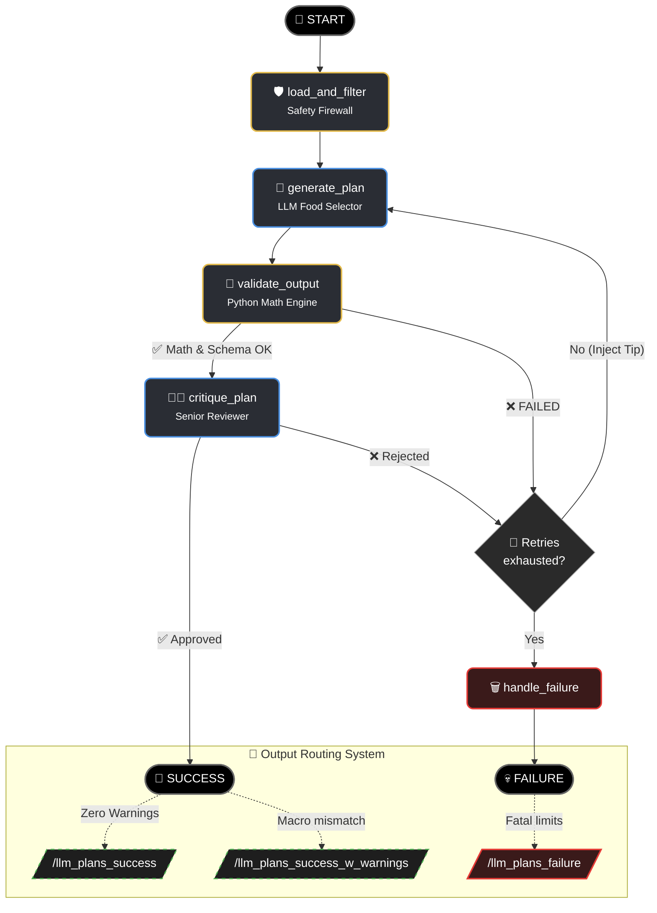
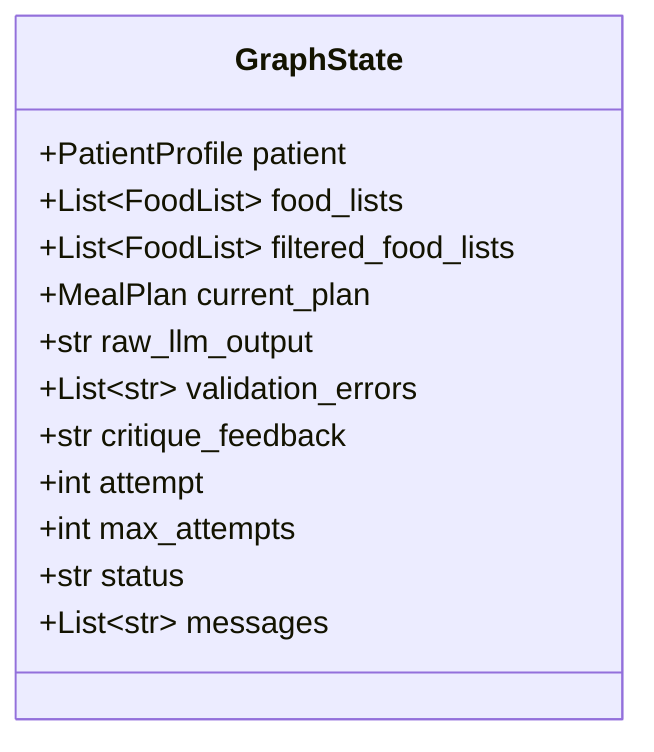

# Architecture – Nutrium Meal Plan Generator

## 1. LangGraph Workflow (Iterative Agent)

## 2. State Schema (Graph Memory)

## 3. Node Operations (Separation of Concerns)

### 🥑 `load_and_filter` (Pre-Flight Firewall)
- **Role**: Drops unwanted items before API usage.
- **Process**: Reads patient `disliked_foods`, `food_allergies`, and maps `food_intolerances` (e.g. "Lactose"). **Physically removes** offending equivalents from the dataset before feeding the prompt, ensuring zero-trust "Safe AI".

### 🧠 `generate_plan` (The Designer)
- **Role**: Orchestrates food pairings and variety.
- **Process**: LLM uses provided choices to draft a full valid JSON. It assigns fractional or integer multipliers `(Multiplier: 1.5)` without doing any math. 
- **Dynamic Prompting**: If retrying from a failure, the prompt receives a `ratio_tip` (e.g., "Change your Multipliers by x1.3!"), forcing the model to iteratively climb/descend scaling thresholds safely.

### 🧮 `validate_output` (The Calculator)
- **Role**: Unforgiving mathematical parser.
- **Process**: Intercepts the generated `(Multiplier: X)`, parses the strings, overrides LLM hallucinated macros, and constructs the absolute nutritional truth from the DB base limits. 
- **Rounding Logic**: A Python custom text-polisher snaps raw Multipliers (e.g., `0.75`) to standard clinical increments (`0.5, 1.0, 1.5`), fixing grammar strings and modifying internal weights deterministically to match the text.
- **Guardrails**: *Calories* falling outside **±10%** represent a `Hard Error` (loops back), while individual Macro discrepancies produce Soft `[WARN]` labels injected into the eventual JSON.

### 👨‍⚕️ `critique_plan` (The Senior Reviewer)
- **Role**: Common sense logic auditor.
- **Process**: Evaluates mathematically perfect plans against human nuance, verifying meal time distributions mapping to wake/sleep habits and flagging bizarre combinations for potential rejection/retry.

### 🗑️ `handle_failure` (Terminal Error State)
- **Role**: The cleanup crew.
- **Process**: Reached if attempts hit exactly `max_attempts(3)`. Forwards the original failing JSON file into `llm_plans_failure/` whilst dynamically appending the ultimate cause of rejection (e.g., Critique's `[WARN]` message) under a new array node within the document for easy debugging.
